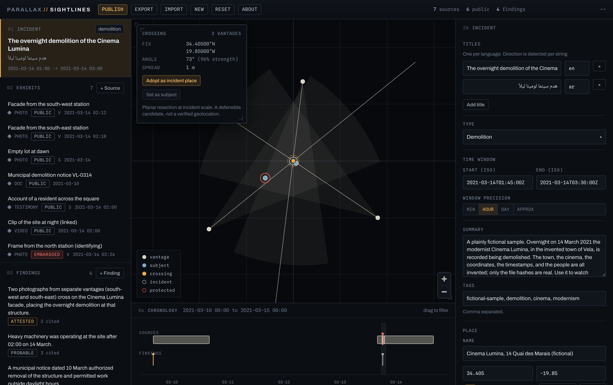
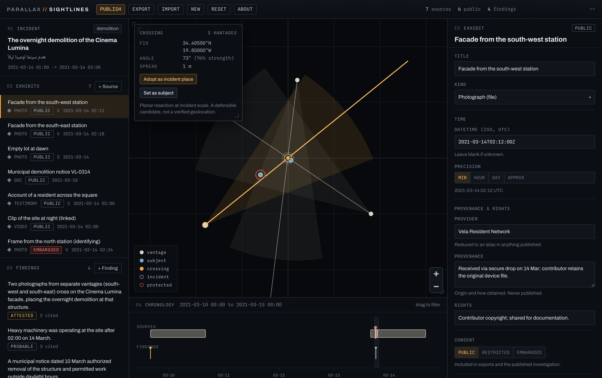
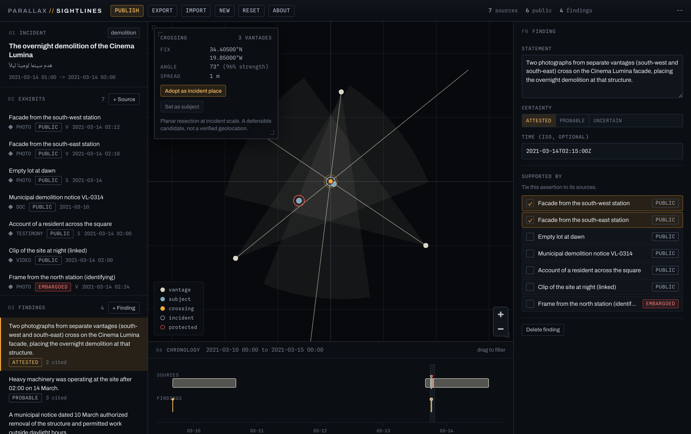
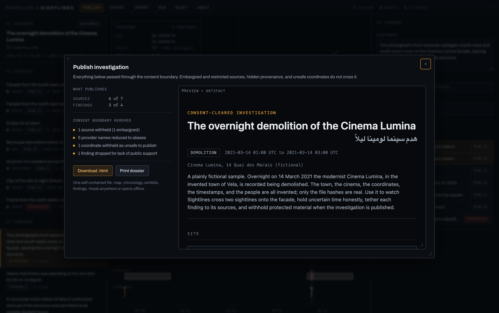
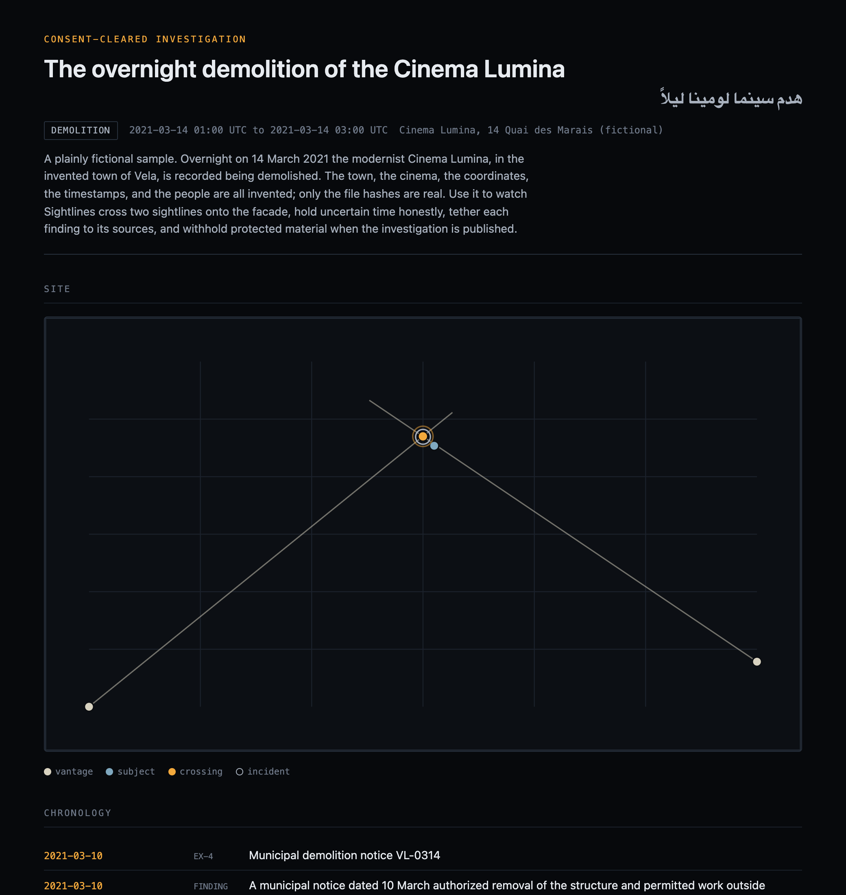

# Sightlines

**Reconstruct one incident or site in time and space, keeping every source tethered to its provenance.**

Sightlines is a client-side, local-first workbench for reconstructing a single
incident or place from scattered material. You gather the sources you hold, hash
what you have, place each photograph's subject and the camera's vantage on a map,
cross the vantage rays to resect a location, order everything on a linked
timeline, and state findings that cite the sources supporting them. The output is
a consent-cleared, self-contained static artifact.

It is the first instrument in the **Parallax** suite. Everything runs in your
browser. No file is uploaded, no map service is called, and the default basemap
fetches no third-party tiles, so nothing about your area of interest leaves your
machine.



---

## Contents

- [What it is](#what-it-is)
- [How it works](#how-it-works)
- [Install and run](#install-and-run)
- [The interface](#the-interface)
- [The incident](#the-incident)
- [Sources (the exhibits)](#sources-the-exhibits)
  - [What a source records](#what-a-source-records)
  - [Consent: who may see this source](#consent-who-may-see-this-source)
  - [Hashing and provenance](#hashing-and-provenance)
- [Placing a source on the map](#placing-a-source-on-the-map)
  - [Subject and vantage](#subject-and-vantage)
  - [The bearing dial and field of view](#the-bearing-dial-and-field-of-view)
- [Crossing sightlines: resection](#crossing-sightlines-resection)
- [The chronology](#the-chronology)
- [Findings](#findings)
- [Consent and release](#consent-and-release)
- [Publishing](#publishing)
- [Saving and sharing projects](#saving-and-sharing-projects)
- [Starting over: New and Reset](#starting-over-new-and-reset)
- [A worked example](#a-worked-example-end-to-end)
- [Keyboard and accessibility](#keyboard-and-accessibility)
- [Limits and caveats](#limits-and-caveats)
- [Privacy and data handling](#privacy-and-data-handling)
- [Troubleshooting](#troubleshooting)

---

## What it is

The investigative question Sightlines answers is: **from these scattered images,
documents, and accounts, where and when did this happen, and which sources
establish it?** It is the counter-forensic move applied to a single event: the
official record is silent or wrong, and the material, read together and placed in
space and time, says otherwise.

Its signature is **resection**. A photograph is not only a picture; it is taken
from somewhere, looking in some direction. Place two or more cameras and the
directions they faced, and where the lines of sight cross is a candidate for what
they were all looking at. Sightlines turns that geometry into a working
instrument, with every line tethered to the source that drew it.

What it is **not**:

- Not a verified geolocation service. A crossing is a defensible candidate, not a
  surveyed coordinate. The tool says so, on screen and in the artifact.
- Not a cloud tool. It calls no service at runtime; you bring the material, and
  nothing about the location leaks.
- Not a general GIS or photo manager. It is a focused instrument for one incident
  at a time.

---

## How it works

A Sightlines investigation is built from a few kinds of record:

- **The incident** is the single event or site under reconstruction. It carries
  its titles (one per language), a type, a time window, a summary, tags, and an
  optional place.
- **Sources** (shown as *exhibits*) are the material you hold: photographs,
  documents, testimony, video. Each carries its kind, a capture time, its
  provider and provenance, rights, a consent level, an optional held file with a
  SHA-256 hash, and any geography it supports (a subject point, a camera vantage).
- **Findings** are source-tethered statements. Each cites the sources that support
  it, carries a certainty, and may be pinned to a time and place.

Everything you publish or export passes through one **consent boundary**, a single
function that decides what may cross. It drops embargoed and restricted sources,
reduces providers to aliases, withholds coordinates marked unsafe, and drops a
finding left with no public support.

Your typed records live in your browser's local storage (IndexedDB), and media
files are held there as blobs. Nothing is sent anywhere. A reload restores your
work.

---

## Install and run

Sightlines is a static client-side app built with Vite.

```bash
cd tools/sightlines
npm install        # first time only
npm run dev        # opens a local dev server (Vite prints the URL)
```

For a production bundle:

```bash
npm run build      # outputs to dist/
npm run preview    # serves the built bundle locally
```

The build is a folder of static files. It runs from any static host or straight
off the filesystem. There is no server component and no build-time secret.

On first launch the app loads a **fictional sample investigation** (an invented
overnight demolition) so there is something to drive immediately. Your work saves
to the browser automatically; a reload restores it.

---

## The interface

The window has three columns and a bar beneath. A left **rail** lists the
incident, the exhibits, and the findings; a central **map**; a right
**inspector** that edits whatever is selected; and a **chronology** docked along
the bottom. The topbar holds the actions and a live **readout** (the count of
sources, how many are public, the count of findings, and the cursor's
coordinates).

- Click the **incident card** at the top of the rail to edit the incident.
- Click any **source** or **finding** row to select it; the inspector switches to
  its editor, and the map and timeline highlight it.
- The map legend names the marker types: vantage, subject, crossing, incident,
  and a red ring for a point that is protected (not safe to publish).

Rows in the rail are keyboard-navigable: tab to a row and press Enter or Space to
select it.

---

## The incident

Selecting the incident card opens its editor in the inspector:

- **Titles.** One per language; text direction (including right-to-left scripts)
  is detected per string. The first title names the investigation and the saved
  file.
- **Type.** What kind of incident this is (demolition, strike, fire, and so on),
  shown as a tag throughout.
- **Time window.** A **start** and **end** in ISO form, with a **precision**
  (minute, hour, day, or approximate) that controls how times are displayed so the
  reconstruction never implies more precision than it has.
- **Summary.** A prose description, shown in the published artifact.
- **Tags.** Comma-separated keywords.
- **Place.** The incident's location: a name, a latitude and longitude, and a
  **safe to publish** toggle. Set it by typing the coordinates, by pressing
  **Move on map** and clicking, or by adopting a resection crossing (below). When
  the place is marked not safe to publish, the boundary withholds both its
  coordinates and its name.

---

## Sources (the exhibits)

Press **+ Source** on the rail's Exhibits section to add one, then edit it in the
inspector.



### What a source records

- **Title** and **kind** (photograph, document, testimony, video, and so on).
- **Time.** A datetime in ISO form, with the same minute/hour/day/approximate
  precision control. Leave it blank if the time is unknown; an undated source
  simply does not appear on the chronology.
- **Provenance and rights.**
  - **Provider**: who supplied the source. In anything published this is reduced
    to a stable alias (Source A, Source B), and the editor says so beneath the
    field.
  - **Provenance**: how the source was obtained, held for your record only and
    never published.
  - **Rights**: a short rights note that may publish.
- **File.** If you attach a file, the tool records its size, dimensions, and a
  SHA-256 hash, and holds the bytes locally. The hash fixes the file; the original
  is never altered.
- **Subject** and **vantage**: the geography this source supports (see below).
- **Note.** A short note that may publish.

### Consent: who may see this source

Every source carries one consent level, the heart of the suite's ethic:

- **Public**: included in exports and the published investigation.
- **Restricted**: held for your work only; dropped at the consent boundary.
- **Embargoed**: held but never published, for material shared on condition it is
  not released.

The editor marks the fields that will never cross the boundary, so you can see at
a glance what stays private.

### Hashing and provenance

The SHA-256 hash, computed in the browser with WebCrypto, is the chain-of-custody
anchor: it lets anyone confirm the published artifact refers to the same file you
held, without the file itself being exposed. This is the Berkeley-Protocol
discipline carried into the tool: keep the original unaltered, hash it, record how
it was obtained.

---

## Placing a source on the map

A source becomes spatial when you give it a subject, a vantage, or both. Select
the source, then use the inspector's placement controls or drop a point directly
on the map.

### Subject and vantage

- The **subject** is what the source shows: the point in the world the photograph
  or account is about.
- The **vantage** is where the camera or witness stood, and the direction it
  faced. A vantage is the ingredient resection needs.

To place either, choose **drop a station** for that source and click the map, or
type the coordinates. Each point carries its own **safe to publish** flag, so a
sensitive vantage can be withheld while the subject still shows.

### The bearing dial and field of view

A vantage is a point plus a **bearing** (the compass direction it looked) and an
optional **field of view**. Drag the bearing dial, or type the degrees, and the
ray and its cone redraw on the map. A **confidence** (attested, probable,
uncertain) records how sure the direction is. The bearing is what lets two
vantages cross; the field of view draws the cone so you can see what each camera
could and could not have seen.

---

## Crossing sightlines: resection

This is the signature move. With two or more vantages placed and aimed, their
rays are drawn across the map, and where they cross, the tool computes a **fix**:
a candidate location for the common subject or the incident.

The crossing card reports:

- **Fix**: the candidate coordinates.
- **Angle** and **strength**: how squarely the rays cross. Rays meeting near a
  right angle give a strong fix; near-parallel rays are reported as weak geometry,
  not a confident false point.
- **Spread**: the size of the uncertainty where the rays do not meet at a single
  point.

From the card you can **Adopt as incident place** (set the incident's location to
the fix) or **Set as subject** for the selected source. The language is
deliberate: the readout calls this a *planar resection at incident scale, a
defensible candidate, not a verified geolocation*, and that caution travels into
the published artifact.

---

## The chronology

The bottom dock is a linked timeline spanning the incident's window. Dated sources
sit on one track and findings on another, so the sequence is legible at a glance.

- Hover or select an item to highlight it across the map, rail, and timeline.
- **Drag to filter**: drag across the timeline to limit the view to a time range;
  click an empty part to clear the filter. A drag anywhere brushes a range; a
  click on an item selects it.

A source with no datetime does not appear here; give it a time to place it.

---

## Findings

Press **+ Finding** on the rail's Findings section. A finding is the claim the
reconstruction supports, and it must cite its evidence.



- **Statement.** The finding text, in one or more languages.
- **Certainty.** Attested, probable, or uncertain, shown as a badge and used to
  style the finding in the artifact.
- **Cited sources.** Tick the sources that support the finding. A finding with no
  surviving public support is dropped at the consent boundary, because an
  unsupported claim is not a finding.
- **Time and place.** Optionally pin the finding to a moment and a location, which
  also places it on the chronology.

---

## Consent and release

Two controls govern what may be published, and they are enforced by architecture,
not by discipline:

- A source's **consent level** (public, restricted, embargoed).
- A point's **safe to publish** flag (on the incident place, a subject, or a
  vantage).

When you publish or export, one boundary function (`publicClone`) runs over the
whole project and:

- keeps only public sources, dropping restricted and embargoed ones entirely;
- reduces every provider name to a stable alias;
- withholds a coordinate marked not safe to publish, or coarsens it to roughly a
  kilometre if you choose the coarsen policy;
- drops a finding left with no public support, and reduces a finding's citation
  when a cited source is withheld;
- omits provenance, held file names, and internal keys, because the public record
  has no field for them.

Nothing sensitive can leak by accident, because nothing sensitive crosses this
boundary.

---

## Publishing

**Publish** in the topbar runs the project through the consent boundary and opens
a dialog that shows, side by side:

- **What publishes**: how many sources and findings survive, out of the totals.
- **What the consent boundary removed**: a plain-language list of every
  withholding (sources dropped by consent, providers aliased, coordinates
  withheld, findings dropped or reduced).
- A live **preview that is the artifact**: the same HTML you will download.



**Download .html** gives you a single self-contained file: the site map with the
vantages, subjects, and crossing; the chronology; the findings with their
citations; the exhibits with their hashes; and a consent disclosure listing
exactly what was removed. It opens offline and hosts anywhere. **Print dossier**
prints the same artifact through a print stylesheet.



---

## Saving and sharing projects

- **Export** saves the whole project as a single `.sightlines.json` file, so it
  round-trips exactly, media included.
- **Import** loads a project file back, replacing the current one.

Exporting is also how you move an investigation between machines or hand it to a
collaborator.

---

## Starting over: New and Reset

- **New** starts an empty investigation. It asks you to confirm in two steps
  (press once to arm, again to confirm), because it discards the current project;
  export first if you want to keep it.
- **Reset** replaces the current project with the fictional sample, the same
  two-step confirm.

Both confirm in the toolbar itself rather than through a browser dialog, so they
work in an installed app and tell you the outcome.

---

## A worked example, end to end

1. Add the photographs and documents you hold as **sources**, attaching the files
   so each is hashed.
2. Set each source's **time** and its **provider**, **provenance**, and
   **consent** level.
3. For each photograph, drop its **vantage** on the map and drag the **bearing**
   to the direction it faced; mark a sensitive vantage not safe to publish.
4. Read the **crossing** where the rays meet, check its strength, and **adopt it
   as the incident place** if it is sound.
5. Order the sources on the **chronology** and confirm the sequence.
6. Write **findings** that cite the sources establishing them.
7. **Publish**, read what the consent boundary withheld, and download the
   artifact.

---

## Keyboard and accessibility

The rail's source and finding rows are reachable by keyboard: tab to a row and
press Enter or Space to select it, with a visible focus ring. Text direction is
detected per string, so right-to-left titles, statements, and notes display
correctly alongside left-to-right text.

---

## Limits and caveats

- **A candidate, not a survey.** A resection crossing is a defensible candidate
  location, not a verified geolocation. Weak (near-parallel) geometry is reported
  as such.
- **You bring the material.** The tool fetches nothing; the reconstruction is only
  as good as the sources you supply and place.
- **The basemap is synthetic.** The default background is a graticule that fetches
  no tiles, so the area of interest never reaches an outside server. It gives
  geometry and scale, not satellite context.

---

## Privacy and data handling

Sightlines is local-first. Typed records and media live in your browser's
IndexedDB and are never uploaded. The synthetic graticule basemap makes no tile
requests, so a sensitive location cannot reach an outside server, because no
request is ever made. The published artifact is a single file you control;
nothing is sent anywhere unless you choose to share that file.

---

## Troubleshooting

- **A source is not on the timeline.** It has no datetime. Add one, with an
  appropriate precision.
- **No crossing appears.** Resection needs at least two vantages, each with a
  bearing. Confirm both vantages are placed and aimed.
- **The crossing is flagged weak.** The rays are too near parallel to fix a point
  confidently. A third vantage from a different angle strengthens it.
- **A source will not publish.** Check its consent level; restricted and embargoed
  sources never cross the boundary. A finding citing only withheld sources is
  dropped.
- **Coordinates look rounded in the artifact.** Safe coordinates are capped to
  about a metre of precision; a point marked not safe to publish is withheld
  entirely, or coarsened if you chose that policy.

---

*Sightlines is part of the Parallax suite. Founded and directed by Jeff O'Brien.*
